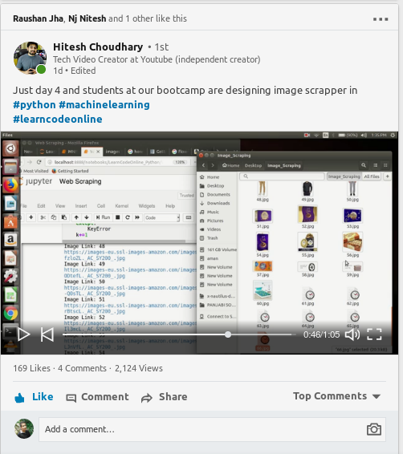

## Web Page Image Scrapper

Web Page Image Scrapper Is An Python Script Which Is Used To Scrap Image From Any Web Page

## Demo(Project Featured By Hitesh Sir)
[](https://youtu.be/asVXjKTD2I4)

## Dependencies

+ requests
+ BeautifulSoup
+ Pillow
+ OS

### Clone this repository

Type the following commands in your terminal:
```
cd path/to/directory/
git clone https://github.com/Aman-py/Self_Driving_Car
cd Web_Page_Image_Scrapper/```

python web_page_scrapper.py
Input Your Link: .....```
